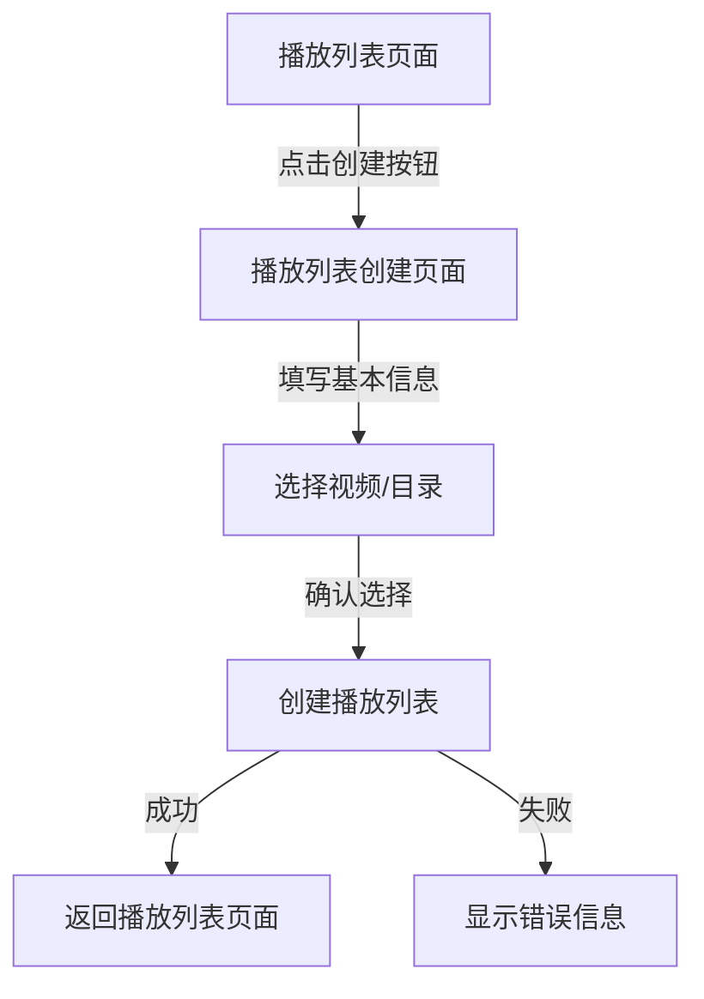

# 播放列表创建页面架构设计

## 1. 概述

本文档描述了将播放列表创建对话框转换为独立页面的架构设计方案，包括在创建时选择视频目录或文件的功能。

## 2. 现有系统分析

### 2.1 当前 CreatePlaylistDialog 功能
- 播放列表名称输入（必填）
- 播放列表描述输入（可选）
- 公开/私密切换
- 表单验证
- 成功/错误状态处理
- 通过 DatabaseService 创建播放列表

### 2.2 数据库 Schema 分析
- `playlistTable`: 存储播放列表基本信息
- `playlistVideoTable`: 存储播放列表与视频的关联关系
- `videoTable`: 存储视频文件信息
- `folderTable`: 存储文件夹信息
- `folderVideoTable`: 存储文件夹与视频的关联关系

### 2.3 文件系统服务
- `FileSystemService`: 提供文件和目录操作功能
- `VideoService`: 提供视频特定的操作功能
- `FilePicker`: 提供文件选择界面

## 3. 新页面架构设计

### 3.1 路由结构

```
app/
├── (tabs)/
│   ├── playlists.tsx          // 播放列表列表页面
│   └── _layout.tsx            // 标签页布局
└── playlist/
    └── create.tsx             // 新的播放列表创建页面
```

### 3.2 导流设计



### 3.3 页面组件结构

```
CreatePlaylistPage/
├── PageContainer              // 页面容器
├── PlaylistForm              // 播放列表基本信息表单
│   ├── NameInput            // 名称输入
│   ├── DescriptionInput     // 描述输入
│   └── PublicToggle        // 公开/私密切换
├── VideoSelectionSection    // 视频选择区域
│   ├── SelectionModeTabs   // 选择模式标签页
│   ├── FilePicker          // 文件选择器
│   ├── DirectoryBrowser    // 目录浏览器
│   └── SelectedItemsList   // 已选择项目列表
└── ActionButtons           // 操作按钮
    ├── CancelButton        // 取消按钮
    └── CreateButton        // 创建按钮
```

## 4. 数据流设计

### 4.1 状态管理

```typescript
interface CreatePlaylistState {
  // 基本信息
  name: string;
  description: string;
  isPublic: boolean;

  // 选择模式
  selectionMode: 'files' | 'directory';

  // 选择的文件
  selectedFiles: FileItem[];

  // 选择的目录
  selectedDirectory: DirectoryItem | null;

  // 目录中的视频
  directoryVideos: Video[];

  // UI状态
  isSubmitting: boolean;
  error: string | null;
  step: 'basic' | 'selection' | 'confirm';
}
```

### 4.2 数据流图


## 5. 组件设计

### 5.1 CreatePlaylistPage 主页面

```typescript
// 路由: /playlist/create
function CreatePlaylistPage() {
  const [state, setState] = useState<CreatePlaylistState>(initialState);
  const navigation = useNavigation();
  const dbService = DatabaseService.getInstance();
  const fileSystemService = FileSystemService.getInstance();

  // 处理表单提交
  const handleSubmit = async () => {
    // 1. 创建播放列表
    // 2. 添加选择的视频到播放列表
    // 3. 处理成功/失败状态
  };

  // 处理文件选择
  const handleFileSelect = async (files: FileItem[]) => {
    // 更新选择的文件列表
  };

  // 处理目录选择
  const handleDirectorySelect = async (directory: DirectoryItem) => {
    // 获取目录中的视频文件
    // 更新选择的目录和视频列表
  };

  return (
    <PageContainer>
      <PlaylistForm
        state={state}
        onChange={setState}
      />
      <VideoSelectionSection
        state={state}
        onFileSelect={handleFileSelect}
        onDirectorySelect={handleDirectorySelect}
      />
      <ActionButtons
        onCancel={() => navigation.goBack()}
        onSubmit={handleSubmit}
        disabled={!isFormValid()}
        loading={state.isSubmitting}
      />
    </PageContainer>
  );
}
```

### 5.2 VideoSelectionSection 组件

```typescript
function VideoSelectionSection({
  state,
  onFileSelect,
  onDirectorySelect
}: VideoSelectionSectionProps) {
  return (
    <View>
      <SelectionModeTabs
        currentMode={state.selectionMode}
        onModeChange={(mode) => setState({ ...state, selectionMode: mode })}
      />

      {state.selectionMode === 'files' ? (
        <FilePicker
          allowMultiple={true}
          allowedTypes={['video/*']}
          onFilesSelected={onFileSelect}
        />
      ) : (
        <DirectoryBrowser
          onDirectorySelect={onDirectorySelect}
        />
      )}

      <SelectedItemsList
        items={state.selectionMode === 'files'
          ? state.selectedFiles
          : state.directoryVideos
        }
        onRemove={(item) => removeSelectedItem(item)}
      />
    </View>
  );
}
```

### 5.3 DirectoryBrowser 组件

```typescript
function DirectoryBrowser({ onDirectorySelect }: DirectoryBrowserProps) {
  const [currentPath, setCurrentPath] = useState('/');
  const [directories, setDirectories] = useState<DirectoryItem[]>([]);
  const fileSystemService = FileSystemService.getInstance();

  // 浏览目录
  const browseDirectory = async (path: string) => {
    const dirs = await fileSystemService.listDirectories(path);
    setDirectories(dirs);
    setCurrentPath(path);
  };

  // 选择目录
  const handleSelect = async (directory: DirectoryItem) => {
    const videos = await fileSystemService.getVideosInDirectory(directory.path);
    onDirectorySelect({
      ...directory,
      videos
    });
  };

  return (
    <View>
      <PathNavigation
        currentPath={currentPath}
        onNavigate={browseDirectory}
      />
      <DirectoryList
        directories={directories}
        onSelect={handleSelect}
        onBrowse={browseDirectory}
      />
    </View>
  );
}
```

## 6. 服务集成

### 6.1 DatabaseService 扩展

```typescript
class DatabaseService {
  // 现有方法...

  /**
   * 创建播放列表并添加视频
   */
  async createPlaylistWithVideos(
    playlistData: Omit<typeof playlistTable.$inferInsert, "id">,
    videoIds: string[]
  ): Promise<Playlist> {
    return await this.transaction(async (tx) => {
      // 创建播放列表
      const [playlist] = await tx
        .insert(playlistTable)
        .values(playlistData)
        .returning();

      // 批量添加视频到播放列表
      if (videoIds.length > 0) {
        const playlistVideos = videoIds.map((videoId, index) => ({
          playlistId: playlist.id,
          videoId,
          position: index,
        }));

        await tx
          .insert(playlistVideoTable)
          .values(playlistVideos);

        // 更新播放列表的视频计数
        await tx
          .update(playlistTable)
          .set({
            videoCount: videoIds.length,
            updatedAt: sql`(CURRENT_TIMESTAMP)`
          })
          .where(eq(playlistTable.id, playlist.id));
      }

      return playlist;
    });
  }

  /**
   * 从目录创建播放列表
   */
  async createPlaylistFromDirectory(
    playlistData: Omit<typeof playlistTable.$inferInsert, "id">,
    directoryPath: string
  ): Promise<Playlist> {
    // 获取目录中的所有视频
    const videos = await this.getVideosByDirectory(directoryPath);
    const videoIds = videos.map(v => v.id);

    return await this.createPlaylistWithVideos(playlistData, videoIds);
  }
}
```

### 6.2 FileSystemService 扩展

```typescript
class FileSystemService {
  // 现有方法...

  /**
   * 获取目录中的所有视频文件
   */
  async getVideosInDirectory(directoryPath: string): Promise<FileItem[]> {
    const allFiles = await this.listDirectory(directoryPath);
    return allFiles.filter(file => file.type === 'video');
  }

  /**
   * 列出目录
   */
  async listDirectories(path: string): Promise<DirectoryItem[]> {
    try {
      const contents = await FileSystem.readDirectoryAsync(path);
      const directories: DirectoryItem[] = [];

      for (const item of contents) {
        const itemPath = `${path}/${item}`;
        const info = await FileSystem.getInfoAsync(itemPath);

        if (info.exists && info.isDirectory) {
          directories.push({
            id: this.generateId(itemPath),
            name: item,
            path: itemPath,
            createdAt: new Date(info.modificationTime || Date.now()),
            modifiedAt: new Date(info.modificationTime || Date.now()),
          });
        }
      }

      return directories;
    } catch (error) {
      throw new Error(`列出目录失败: ${error.message}`);
    }
  }
}
```

## 7. 路由配置

### 7.1 更新 _layout.tsx

```typescript
// app/_layout.tsx
export default function RootLayout() {
  // ... 现有代码

  return (
    <DatabaseProvider>
      <ThemeProvider value={colorScheme === "dark" ? DARK_THEME : LIGHT_THEME}>
        <GestureHandlerRootView style={{ flex: 1 }}>
          <BottomSheetModalProvider>
            <Stack>
              <Stack.Screen
                name="(tabs)"
                options={{ title: "Videotape", headerShown: false }}
              />
              <Stack.Screen
                options={{
                  headerShadowVisible: false,
                }}
                name="upload"
              />
              <Stack.Screen
                options={{
                  headerShadowVisible: false,
                }}
                name="video/[id]"
              />
              {/* 新增播放列表创建页面路由 */}
              <Stack.Screen
                options={{
                  title: "创建播放列表",
                  headerBackTitle: "返回",
                }}
                name="playlist/create"
              />
            </Stack>
          </BottomSheetModalProvider>
        </GestureHandlerRootView>
      </ThemeProvider>
      <PortalHost />
    </DatabaseProvider>
  );
}
```

### 7.2 更新 playlists.tsx 导航

```typescript
// app/(tabs)/playlists.tsx
export default function PlaylistsScreen() {
  // ... 现有代码

  return (
    <View className="flex-1 bg-background p-4">
      <Stack.Screen
        options={{
          title: "播放列表",
          headerRight: () => (
            <TouchableOpacity
              className="mr-4"
              onPress={() => router.push('/playlist/create')}
            >
              <Plus className="w-6 h-6 text-foreground" />
            </TouchableOpacity>
          ),
        }}
      />

      {/* ... 现有代码 */}

      {/* 移除 CreatePlaylistDialog */}
    </View>
  );
}
```

## 8. 实现计划

1. **第一阶段**: 创建基本的页面结构和路由
2. **第二阶段**: 实现播放列表基本信息表单
3. **第三阶段**: 实现视频文件选择功能
4. **第四阶段**: 实现目录浏览和选择功能
5. **第五阶段**: 集成数据库服务，实现播放列表创建
6. **第六阶段**: 测试和优化

## 9. 注意事项

1. **权限处理**: 确保正确处理文件系统访问权限
2. **错误处理**: 提供清晰的错误提示和恢复机制
3. **性能优化**: 大量文件选择时的性能考虑
4. **用户体验**: 提供清晰的操作流程和反馈
5. **数据一致性**: 确保播放列表和视频关联数据的一致性
