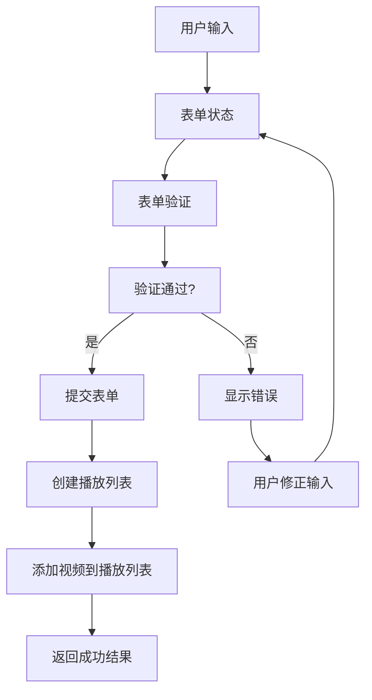

# 播放列表创建表单更新设计

## 1. 概述

本文档详细描述了如何更新播放列表创建表单，以支持在创建时选择视频目录或文件的功能。包括表单结构、验证逻辑、状态管理和用户交互流程。

## 2. 表单架构设计

### 2.1 表单组件结构

```
CreatePlaylistForm (主表单组件)
├── BasicInfoSection (基本信息区域)
│   ├── NameInput (名称输入)
│   ├── DescriptionInput (描述输入)
│   └── PublicToggle (公开/私密切换)
├── VideoSelectionSection (视频选择区域)
│   ├── SelectionModeTabs (选择模式切换)
│   ├── FileSelectionContent (文件选择内容)
│   └── DirectorySelectionContent (目录选择内容)
├── FormActions (表单操作)
│   ├── CancelButton (取消按钮)
│   ├── CreateButton (创建按钮)
│   └── LoadingIndicator (加载指示器)
└── FormValidation (表单验证)
    ├── ValidationSummary (验证摘要)
    └── FieldErrors (字段错误)
```

### 2.2 表单数据流



## 3. 表单状态管理

### 3.1 表单状态定义

```typescript
// src/features/playlist/types/playlist-form.ts
export interface PlaylistFormState {
  // 基本信息
  name: string;
  description: string;
  isPublic: boolean;
  tags: string[];

  // 视频选择
  selectionMode: 'files' | 'directory';
  selectedFiles: FileItem[];
  selectedDirectory: DirectoryItem | null;
  directoryVideos: Video[];

  // 表单状态
  isSubmitting: boolean;
  isSubmitted: boolean;
  errors: FormErrors;

  // 步骤控制
  currentStep: 'basic' | 'selection' | 'confirm';
}

export interface FormErrors {
  name?: string;
  description?: string;
  selection?: string;
  general?: string;
}
```

### 3.2 表单验证 Schema

```typescript
// src/features/playlist/types/playlist-form.ts
import { z } from 'zod';

// 扩展原有的播放列表创建 schema
export const createPlaylistWithVideosSchema = z.object({
  name: z
    .string()
    .min(1, "播放列表名称不能为空")
    .max(100, "播放列表名称不能超过100个字符"),
  description: z
    .string()
    .max(500, "播放列表描述不能超过500个字符")
    .optional()
    .nullable(),
  isPublic: z.boolean().default(false),
  tags: z.array(z.string()).default([]),
  selectionMode: z.enum(['files', 'directory']),
  selectedFiles: z.array(z.object({
    id: z.string(),
    name: z.string(),
    uri: z.string(),
    size: z.number(),
    type: z.string(),
    mimeType: z.string(),
  })).optional(),
  selectedDirectory: z.object({
    id: z.string(),
    name: z.string(),
    path: z.string(),
  }).optional(),
  directoryVideos: z.array(z.object({
    id: z.string(),
    title: z.string(),
    filePath: z.string(),
    duration: z.number(),
    fileSize: z.number(),
  })).optional(),
}).refine(data => {
  // 验证至少选择了文件或目录
  if (data.selectionMode === 'files') {
    return data.selectedFiles && data.selectedFiles.length > 0;
  } else {
    return data.selectedDirectory && data.directoryVideos && data.directoryVideos.length > 0;
  }
}, {
  message: "请至少选择一个视频文件或包含视频的目录",
  path: ["selection"],
});

export type CreatePlaylistWithVideosForm = z.infer<typeof createPlaylistWithVideosSchema>;
```

## 4. 表单组件实现

### 4.1 CreatePlaylistForm 主表单组件

```typescript
// src/features/playlist/components/CreatePlaylistForm.tsx
import { useState, useEffect } from 'react';
import { useForm, Controller } from 'react-hook-form';
import { zodResolver } from '@hookform/resolvers/zod';
import { View, ScrollView, StyleSheet } from 'react-native';
import { useNavigation } from 'expo-router';
import { Check, X, Plus, Loader2 } from '@/components/Icons';
import { Button } from '@/components/ui/button';
import { Input } from '@/components/ui/input';
import { Text } from '@/components/ui/text';
import { Form, FormElement } from '@/components/ui/form';
import { createPlaylistWithVideosSchema, type CreatePlaylistWithVideosForm } from '../types/playlist-form';
import { BasicInfoSection } from './BasicInfoSection';
import { VideoSelectionSection } from './VideoSelectionSection';
import { FormActions } from './FormActions';
import { FormValidationSummary } from './FormValidationSummary';
import { DatabaseService } from '@/db/database-service';
import { FileSystemService } from '@/services/fileSystemService';
import type { Playlist } from '@/db/schema';

interface CreatePlaylistFormProps {
  onSuccess?: (playlist: Playlist) => void;
  onCancel?: () => void;
}

export function CreatePlaylistForm({
  onSuccess,
  onCancel
}: CreatePlaylistFormProps) {
  const navigation = useNavigation();
  const [isSubmitting, setIsSubmitting] = useState(false);
  const [currentStep, setCurrentStep] = useState<'basic' | 'selection' | 'confirm'>('basic');

  const form = useForm<CreatePlaylistWithVideosForm>({
    resolver: zodResolver(createPlaylistWithVideosSchema),
    defaultValues: {
      name: '',
      description: '',
      isPublic: false,
      tags: [],
      selectionMode: 'files',
      selectedFiles: [],
      selectedDirectory: null,
      directoryVideos: [],
    },
    mode: 'onChange',
  });

  const {
    control,
    handleSubmit,
    watch,
    setValue,
    trigger,
    formState: { errors, isValid },
  } = form;

  const watchedValues = watch();

  // 处理步骤变化
  const handleNextStep = async () => {
    const isStepValid = await trigger(currentStep === 'basic' ? ['name', 'description'] : ['selection']);
    if (isStepValid) {
      setCurrentStep(currentStep === 'basic' ? 'selection' : 'confirm');
    }
  };

  const handlePreviousStep = () => {
    setCurrentStep(currentStep === 'confirm' ? 'selection' : 'basic');
  };

  // 处理表单提交
  const onSubmit = async (data: CreatePlaylistWithVideosForm) => {
    setIsSubmitting(true);

    try {
      const dbService = DatabaseService.getInstance();
      const fileSystemService = FileSystemService.getInstance();

      // 准备播放列表数据
      const playlistData = {
        name: data.name.trim(),
        description: data.description?.trim() || null,
        isPublic: data.isPublic,
        tags: data.tags,
      };

      let playlist: Playlist;

      if (data.selectionMode === 'files') {
        // 从选择的文件创建播放列表
        const videoIds = data.selectedFiles.map(file => file.id);
        playlist = await dbService.createPlaylistWithVideos(playlistData, videoIds);
      } else {
        // 从选择的目录创建播放列表
        playlist = await dbService.createPlaylistFromDirectory(
          playlistData,
          data.selectedDirectory!.path
        );
      }

      // 成功回调
      onSuccess?.(playlist);

      // 返回播放列表页面
      navigation.goBack();

    } catch (error) {
      console.error('创建播放列表失败:', error);

      // 设置错误信息
      setValue('selection', []);
      trigger('selection');

    } finally {
      setIsSubmitting(false);
    }
  };

  return (
    <Form {...form}>
      <FormElement onSubmit={handleSubmit(onSubmit)} className="flex-1">
        <ScrollView className="flex-1" showsVerticalScrollIndicator={false}>
          <View className="space-y-6 p-4">
            {/* 步骤指示器 */}
            <StepIndicator currentStep={currentStep} />

            {/* 基本信息步骤 */}
            {currentStep === 'basic' && (
              <BasicInfoSection
                control={control}
                errors={errors}
                watchedValues={watchedValues}
                setValue={setValue}
                trigger={trigger}
              />
            )}

            {/* 视频选择步骤 */}
            {currentStep === 'selection' && (
              <VideoSelectionSection
                control={control}
                errors={errors}
                watchedValues={watchedValues}
                setValue={setValue}
                trigger={trigger}
              />
            )}

            {/* 确认步骤 */}
            {currentStep === 'confirm' && (
              <ConfirmSection
                watchedValues={watchedValues}
                onEdit={() => setCurrentStep('basic')}
              />
            )}

            {/* 表单验证摘要 */}
            <FormValidationSummary errors={errors} />
          </View>
        </ScrollView>

        {/* 表单操作按钮 */}
        <FormActions
          currentStep={currentStep}
          isSubmitting={isSubmitting}
          isValid={isValid}
          hasSelection={
            watchedValues.selectionMode === 'files'
              ? watchedValues.selectedFiles?.length > 0
              : watchedValues.directoryVideos?.length > 0
          }
          onNext={handleNextStep}
          onPrevious={handlePreviousStep}
          onSubmit={handleSubmit(onSubmit)}
          onCancel={onCancel}
        />
      </FormElement>
    </Form>
  );
}
```

### 4.2 BasicInfoSection 基本信息区域组件

```typescript
// src/features/playlist/components/BasicInfoSection.tsx
import { Control, FieldErrors, UseFormSetValue, UseFormTrigger } from 'react-hook-form';
import { View, Text } from 'react-native';
import { Controller } from 'react-hook-form';
import { Eye, EyeOff, Check } from '@/components/Icons';
import { Input } from '@/components/ui/input';
import { Text } from '@/components/ui/text';
import { Button } from '@/components/ui/button';
import { type CreatePlaylistWithVideosForm } from '../types/playlist-form';

interface BasicInfoSectionProps {
  control: Control<CreatePlaylistWithVideosForm>;
  errors: FieldErrors<CreatePlaylistWithVideosForm>;
  watchedValues: Partial<CreatePlaylistWithVideosForm>;
  setValue: UseFormSetValue<CreatePlaylistWithVideosForm>;
  trigger: UseFormTrigger<CreatePlaylistWithVideosForm>;
}

export function BasicInfoSection({
  control,
  errors,
  watchedValues,
  setValue,
  trigger
}: BasicInfoSectionProps) {
  const [showPublicToggle, setShowPublicToggle] = useState(false);

  // 自动显示公开切换按钮
  useEffect(() => {
    if (watchedValues.name && watchedValues.name.length > 3) {
      setShowPublicToggle(true);
    } else {
      setShowPublicToggle(false);
      setValue('isPublic', false);
    }
  }, [watchedValues.name, setValue]);

  const togglePublic = () => {
    setValue('isPublic', !watchedValues.isPublic);
  };

  return (
    <View className="space-y-4">
      <View>
        <Text className="text-lg font-semibold mb-4">基本信息</Text>
        <Text className="text-sm text-muted-foreground mb-6">
          填写播放列表的基本信息，这些信息将帮助您更好地组织和管理视频。
        </Text>
      </View>

      {/* 播放列表名称 */}
      <View className="space-y-2">
        <View className="flex items-center justify-between">
          <Text className="text-sm font-medium">播放列表名称 *</Text>
          {showPublicToggle && (
            <Button
              variant="ghost"
              size="sm"
              onPress={togglePublic}
              className="flex items-center gap-1"
            >
              {watchedValues.isPublic ? (
                <Eye className="w-4 h-4 text-green-600" />
              ) : (
                <EyeOff className="w-4 h-4 text-muted-foreground" />
              )}
              <Text className="text-xs">
                {watchedValues.isPublic ? "公开" : "私密"}
              </Text>
            </Button>
          )}
        </View>
        <Controller
          control={control}
          name="name"
          render={({ field: { onChange, value } }) => (
            <Input
              placeholder="输入播放列表名称"
              value={value}
              onChangeText={(text) => {
                onChange(text);
                trigger('name');
              }}
              className={errors.name ? "border-destructive" : ""}
            />
          )}
        />
        {errors.name && (
          <Text className="text-sm text-destructive">
            {errors.name.message}
          </Text>
        )}
        {watchedValues.name && watchedValues.name.length > 0 && (
          <Text className="text-xs text-muted-foreground">
            {watchedValues.name.length}/100 字符
          </Text>
        )}
      </View>

      {/* 播放列表描述 */}
      <View className="space-y-2">
        <View className="flex items-center justify-between">
          <Text className="text-sm font-medium">描述（可选）</Text>
          {watchedValues.name && watchedValues.name.length > 0 && (
            <Text className="text-xs text-muted-foreground">
              添加描述有助于识别播放列表
            </Text>
          )}
        </View>
        <Controller
          control={control}
          name="description"
          render={({ field: { onChange, value } }) => (
            <Input
              placeholder="输入播放列表描述"
              value={value || ''}
              onChangeText={(text) => {
                onChange(text);
                trigger('description');
              }}
              multiline
              numberOfLines={3}
              className={errors.description ? "border-destructive" : ""}
            />
          )}
        />
        {errors.description && (
          <Text className="text-sm text-destructive">
            {errors.description.message}
          </Text>
        )}
        {watchedValues.description && (
          <Text className="text-xs text-muted-foreground">
            {watchedValues.description.length}/500 字符
          </Text>
        )}
      </View>

      {/* 标签输入 */}
      <View className="space-y-2">
        <Text className="text-sm font-medium">标签（可选）</Text>
        <Controller
          control={control}
          name="tags"
          render={({ field: { onChange, value } }) => (
            <Input
              placeholder="输入标签，用逗号分隔"
              value={value?.join(', ') || ''}
              onChangeText={(text) => {
                const tags = text.split(',').map(tag => tag.trim()).filter(Boolean);
                onChange(tags);
              }}
            />
          )}
        />
        <Text className="text-xs text-muted-foreground">
          标签可以帮助您更好地分类和搜索播放列表
        </Text>
      </View>
    </View>
  );
}
```

### 4.3 StepIndicator 步骤指示器组件

```typescript
// src/features/playlist/components/StepIndicator.tsx
interface StepIndicatorProps {
  currentStep: 'basic' | 'selection' | 'confirm';
}

export function StepIndicator({ currentStep }: StepIndicatorProps) {
  const steps = [
    { key: 'basic', label: '基本信息' },
    { key: 'selection', label: '选择视频' },
    { key: 'confirm', label: '确认创建' },
  ];

  return (
    <View className="flex-row items-center justify-between mb-6">
      {steps.map((step, index) => (
        <React.Fragment key={step.key}>
          <View className="flex items-center">
            <View
              className={`w-8 h-8 rounded-full flex items-center justify-center ${
                currentStep === step.key
                  ? 'bg-primary'
                  : steps.findIndex(s => s.key === currentStep) > index
                  ? 'bg-muted'
                  : 'bg-green-500'
              }`}
            >
              {steps.findIndex(s => s.key === currentStep) > index ? (
                <Text className="text-white text-sm font-medium">
                  {index + 1}
                </Text>
              ) : (
                <Check className="w-4 h-4 text-white" />
              )}
            </View>
            <Text
              className={`text-xs mt-1 ${
                currentStep === step.key
                  ? 'text-primary font-medium'
                  : 'text-muted-foreground'
              }`}
            >
              {step.label}
            </Text>
          </View>

          {index < steps.length - 1 && (
            <View
              className={`flex-1 h-0.5 mx-2 ${
                steps.findIndex(s => s.key === currentStep) > index
                  ? 'bg-muted'
