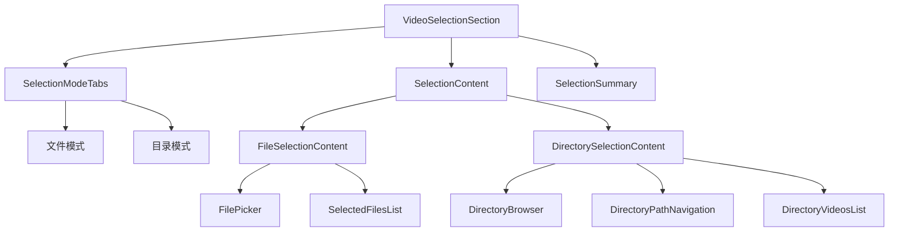
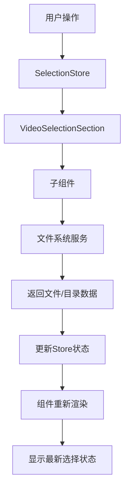

# 视频/目录选择组件架构设计

## 1. 概述

本文档详细描述了播放列表创建页面中视频/目录选择组件的架构设计，包括组件结构、数据流、交互逻辑和实现细节。

## 2. 组件架构总览

### 2.1 组件层次结构

```
VideoSelectionSection (主选择区域)
├── SelectionModeTabs (选择模式切换)
├── SelectionContent (选择内容区域)
│   ├── FileSelectionContent (文件选择内容)
│   │   ├── FilePicker (文件选择器)
│   │   └── SelectedFilesList (已选文件列表)
│   └── DirectorySelectionContent (目录选择内容)
│       ├── DirectoryBrowser (目录浏览器)
│       ├── DirectoryPathNavigation (路径导航)
│       └── DirectoryVideosList (目录视频列表)
└── SelectionSummary (选择摘要)
```

### 2.2 组件关系图



## 3. 核心组件设计

### 3.1 VideoSelectionSection 主组件

```typescript
// src/features/playlist/components/VideoSelectionSection.tsx
interface VideoSelectionSectionProps {
  mode: 'files' | 'directory';
  selectedFiles: FileItem[];
  selectedDirectory: DirectoryItem | null;
  directoryVideos: Video[];
  onModeChange: (mode: 'files' | 'directory') => void;
  onFilesSelected: (files: FileItem[]) => void;
  onDirectorySelected: (directory: DirectoryItem) => void;
  onFileRemove: (file: FileItem) => void;
  onVideoRemove: (video: Video) => void;
}

export function VideoSelectionSection({
  mode,
  selectedFiles,
  selectedDirectory,
  directoryVideos,
  onModeChange,
  onFilesSelected,
  onDirectorySelected,
  onFileRemove,
  onVideoRemove
}: VideoSelectionSectionProps) {
  return (
    <View className="space-y-4">
      {/* 模式切换 */}
      <SelectionModeTabs
        currentMode={mode}
        onModeChange={onModeChange}
      />

      {/* 选择内容区域 */}
      {mode === 'files' ? (
        <FileSelectionContent
          selectedFiles={selectedFiles}
          onFilesSelected={onFilesSelected}
          onFileRemove={onFileRemove}
        />
      ) : (
        <DirectorySelectionContent
          selectedDirectory={selectedDirectory}
          directoryVideos={directoryVideos}
          onDirectorySelected={onDirectorySelected}
          onVideoRemove={onVideoRemove}
        />
      )}

      {/* 选择摘要 */}
      <SelectionSummary
        mode={mode}
        selectedFiles={selectedFiles}
        directoryVideos={directoryVideos}
      />
    </View>
  );
}
```

### 3.2 SelectionModeTabs 模式切换组件

```typescript
// src/features/playlist/components/SelectionModeTabs.tsx
interface SelectionModeTabsProps {
  currentMode: 'files' | 'directory';
  onModeChange: (mode: 'files' | 'directory') => void;
}

export function SelectionModeTabs({
  currentMode,
  onModeChange
}: SelectionModeTabsProps) {
  return (
    <View className="flex-row bg-muted rounded-lg p-1">
      <TouchableOpacity
        className={`flex-1 py-2 px-4 rounded-md transition-colors ${
          currentMode === 'files'
            ? 'bg-primary shadow-sm'
            : 'bg-transparent'
        }`}
        onPress={() => onModeChange('files')}
      >
        <Text
          className={`text-center font-medium ${
            currentMode === 'files'
              ? 'text-primary-foreground'
              : 'text-muted-foreground'
          }`}
        >
          选择文件
        </Text>
      </TouchableOpacity>

      <TouchableOpacity
        className={`flex-1 py-2 px-4 rounded-md transition-colors ${
          currentMode === 'directory'
            ? 'bg-primary shadow-sm'
            : 'bg-transparent'
        }`}
        onPress={() => onModeChange('directory')}
      >
        <Text
          className={`text-center font-medium ${
            currentMode === 'directory'
              ? 'text-primary-foreground'
              : 'text-muted-foreground'
          }`}
        >
          选择目录
        </Text>
      </TouchableOpacity>
    </View>
  );
}
```

### 3.3 FileSelectionContent 文件选择内容组件

```typescript
// src/features/playlist/components/FileSelectionContent.tsx
interface FileSelectionContentProps {
  selectedFiles: FileItem[];
  onFilesSelected: (files: FileItem[]) => void;
  onFileRemove: (file: FileItem) => void;
}

export function FileSelectionContent({
  selectedFiles,
  onFilesSelected,
  onFileRemove
}: FileSelectionContentProps) {
  const fileSystemService = FileSystemService.getInstance();

  const handleFilePicker = async () => {
    try {
      // 使用 DocumentPicker 选择多个视频文件
      const result = await DocumentPicker.getDocumentAsync({
        type: ['video/*'],
        multiple: true,
        copyToCacheDirectory: true,
      });

      if (result.type === 'success' && result.assets) {
        const videoFiles = result.assets
          .filter(asset => asset.mimeType?.startsWith('video/'))
          .map(asset => ({
            id: asset.uri,
            name: asset.name,
            uri: asset.uri,
            size: asset.size || 0,
            type: 'video',
            mimeType: asset.mimeType || 'video/mp4',
            createdAt: new Date(),
            modifiedAt: new Date(),
            isFavorite: false,
            isDeleted: false,
          }));

        onFilesSelected(videoFiles);
      }
    } catch (error) {
      console.error('文件选择失败:', error);
      Alert.alert('错误', '选择文件失败，请重试');
    }
  };

  const handleMediaLibraryPicker = async () => {
    try {
      const { status } = await MediaLibrary.requestPermissionsAsync();

      if (status === 'granted') {
        const media = await MediaLibrary.getAssetsAsync({
          mediaType: MediaLibrary.MediaType.video,
          first: 50, // 限制一次选择的数量
        });

        if (media.assets.length > 0) {
          const videoFiles = media.assets.map(asset => ({
            id: asset.id,
            name: asset.filename,
            uri: asset.uri,
            size: 0, // MediaLibrary 不提供文件大小
            type: 'video',
            mimeType: 'video/mp4',
            createdAt: new Date(asset.creationTime),
            modifiedAt: new Date(asset.modificationTime),
            isFavorite: false,
            isDeleted: false,
          }));

          onFilesSelected(videoFiles);
        }
      } else {
        Alert.alert('权限错误', '需要媒体库权限才能访问视频');
      }
    } catch (error) {
      console.error('媒体库选择失败:', error);
      Alert.alert('错误', '从媒体库选择失败，请重试');
    }
  };

  return (
    <View className="space-y-4">
      {/* 文件选择按钮 */}
      <View className="space-y-2">
        <TouchableOpacity
          className="bg-card border border-border rounded-lg p-4 flex-row items-center justify-between"
          onPress={handleFilePicker}
        >
          <View className="flex-row items-center space-x-3">
            <FolderOpen className="w-5 h-5 text-muted-foreground" />
            <View>
              <Text className="font-medium">从文件系统选择</Text>
              <Text className="text-sm text-muted-foreground">
                选择设备中的视频文件
              </Text>
            </View>
          </View>
          <ChevronRight className="w-5 h-5 text-muted-foreground" />
        </TouchableOpacity>

        <TouchableOpacity
          className="bg-card border border-border rounded-lg p-4 flex-row items-center justify-between"
          onPress={handleMediaLibraryPicker}
        >
          <View className="flex-row items-center space-x-3">
            <Play className="w-5 h-5 text-muted-foreground" />
            <View>
              <Text className="font-medium">从媒体库选择</Text>
              <Text className="text-sm text-muted-foreground">
                选择设备媒体库中的视频
              </Text>
            </View>
          </View>
          <ChevronRight className="w-5 h-5 text-muted-foreground" />
        </TouchableOpacity>
      </View>

      {/* 已选文件列表 */}
      {selectedFiles.length > 0 && (
        <SelectedFilesList
          files={selectedFiles}
          onFileRemove={onFileRemove}
        />
      )}
    </View>
  );
}
```

### 3.4 DirectorySelectionContent 目录选择内容组件

```typescript
// src/features/playlist/components/DirectorySelectionContent.tsx
interface DirectorySelectionContentProps {
  selectedDirectory: DirectoryItem | null;
  directoryVideos: Video[];
  onDirectorySelected: (directory: DirectoryItem) => void;
  onVideoRemove: (video: Video) => void;
}

export function DirectorySelectionContent({
  selectedDirectory,
  directoryVideos,
  onDirectorySelected,
  onVideoRemove
}: DirectorySelectionContentProps) {
  const [currentPath, setCurrentPath] = useState(FileSystem.documentDirectory || '/');
  const [directories, setDirectories] = useState<DirectoryItem[]>([]);
  const [loading, setLoading] = useState(false);

  const fileSystemService = FileSystemService.getInstance();

  // 加载目录列表
  const loadDirectories = async (path: string) => {
    try {
      setLoading(true);
      const dirs = await fileSystemService.listDirectories(path);
      setDirectories(dirs);
      setCurrentPath(path);
    } catch (error) {
      console.error('加载目录失败:', error);
      Alert.alert('错误', '加载目录失败，请重试');
    } finally {
      setLoading(false);
    }
  };

  // 选择目录
  const handleDirectorySelect = async (directory: DirectoryItem) => {
    try {
      setLoading(true);
      const videos = await fileSystemService.getVideosInDirectory(directory.path);

      const directoryWithVideos: DirectoryItem = {
        ...directory,
        videos
      };

      onDirectorySelected(directoryWithVideos);
    } catch (error) {
      console.error('选择目录失败:', error);
      Alert.alert('错误', '选择目录失败，请重试');
    } finally {
      setLoading(false);
    }
  };

  // 导航到父目录
  const navigateToParent = () => {
    const parentPath = currentPath.split('/').slice(0, -1).join('/') || '/';
    loadDirectories(parentPath);
  };

  // 导航到指定目录
  const navigateToDirectory = (path: string) => {
    loadDirectories(path);
  };

  useEffect(() => {
    loadDirectories(currentPath);
  }, []);

  return (
    <View className="space-y-4">
      {/* 目录选择区域 */}
      <View className="bg-card border border-border rounded-lg p-4">
        <DirectoryPathNavigation
          currentPath={currentPath}
          onNavigate={navigateToDirectory}
          onNavigateUp={navigateToParent}
        />

        {loading ? (
          <View className="py-8 items-center justify-center">
            <ActivityIndicator size="large" color="#007AFF" />
            <Text className="mt-2 text-muted-foreground">加载中...</Text>
          </View>
        ) : (
          <DirectoryList
            directories={directories}
            onDirectorySelect={handleDirectorySelect}
            onDirectoryNavigate={navigateToDirectory}
          />
        )}
      </View>

      {/* 目录视频列表 */}
      {selectedDirectory && directoryVideos.length > 0 && (
        <DirectoryVideosList
          videos={directoryVideos}
          onVideoRemove={onVideoRemove}
        />
      )}
    </View>
  );
}
```

### 3.5 DirectoryPathNavigation 目录路径导航组件

```typescript
// src/features/playlist/components/DirectoryPathNavigation.tsx
interface DirectoryPathNavigationProps {
  currentPath: string;
  onNavigate: (path: string) => void;
  onNavigateUp: () => void;
}

export function DirectoryPathNavigation({
  currentPath,
  onNavigate,
  onNavigateUp
}: DirectoryPathNavigationProps) {
  // 将路径拆分为组件
  const pathComponents = currentPath.split('/').filter(Boolean);

  return (
    <View className="space-y-3">
      {/* 当前路径显示 */}
      <View className="flex-row items-center justify-between">
        <Text className="text-sm font-medium text-muted-foreground">
          当前路径
        </Text>
        <TouchableOpacity
          onPress={onNavigateUp}
          disabled={currentPath === '/'}
          className={currentPath === '/' ? 'opacity-50' : ''}
        >
          <ArrowUp className="w-4 h-4 text-muted-foreground" />
        </TouchableOpacity>
      </View>

      {/* 路径导航 */}
      <ScrollView horizontal showsHorizontalScrollIndicator={false}>
        <View className="flex-row items-center space-x-1">
          {/* 根目录 */}
          <TouchableOpacity
            onPress={() => onNavigate('/')}
            className="px-2 py-1 rounded bg-muted"
          >
            <Text className="text-sm">根目录</Text>
          </TouchableOpacity>

          {/* 路径分隔符 */}
          <ChevronRight className="w-4 h-4 text-muted-foreground" />

          {/* 路径组件 */}
          {pathComponents.map((component, index) => {
            const path = '/' + pathComponents.slice(0, index + 1).join('/');
            const isLast = index === pathComponents.length - 1;

            return (
              <React.Fragment key={index}>
                <TouchableOpacity
                  onPress={() => onNavigate(path)}
                  className={`px-2 py-1 rounded ${
                    isLast ? 'bg-primary' : 'bg-muted'
                  }`}
                  disabled={isLast}
                >
                  <Text
                    className={`text-sm ${
                      isLast ? 'text-primary-foreground' : 'text-muted-foreground'
                    }`}
                  >
                    {component}
                  </Text>
                </TouchableOpacity>

                {index < pathComponents.length - 1 && (
                  <ChevronRight className="w-4 h-4 text-muted-foreground" />
                )}
              </React.Fragment>
            );
          })}
        </View>
      </ScrollView>
    </View>
  );
}
```

### 3.6 DirectoryList 目录列表组件

```typescript
// src/features/playlist/components/DirectoryList.tsx
interface DirectoryListProps {
  directories: DirectoryItem[];
  onDirectorySelect: (directory: DirectoryItem) => void;
  onDirectoryNavigate: (path: string) => void;
}

export function DirectoryList({
  directories,
  onDirectorySelect,
  onDirectoryNavigate
}: DirectoryListProps) {
  if (directories.length === 0) {
    return (
      <View className="py-8 items-center justify-center">
        <FolderOpen className="w-12 h-12 text-muted-foreground mb-2" />
        <Text className="text-muted-foreground">此目录为空</Text>
      </View>
    );
  }

  return (
    <FlatList
      data={directories}
      keyExtractor={(item) => item.id}
      renderItem={({ item }) => (
        <TouchableOpacity
          className="flex-row items-center justify-between p-3 border-b border-border"
          onPress={() => onDirectoryNavigate(item.path)}
        >
          <View className="flex-row items-center space-x-3">
            <Folder className="w-5 h-5 text-muted-foreground" />
            <View>
              <Text className="font-medium">{item.name}</Text>
              <Text className="text-xs text-muted-foreground">
                {item.path}
              </Text>
            </View>
          </View>

          <View className="flex-row items-center space-x-2">
            <TouchableOpacity
              onPress={(e) => {
                e.stopPropagation();
                onDirectorySelect(item);
              }}
              className="bg-primary px-3 py-1 rounded-full"
            >
              <Text className="text-primary-foreground text-sm">选择</Text>
            </TouchableOpacity>
            <ChevronRight className="w-4 h-4 text-muted-foreground" />
          </View>
        </TouchableOpacity>
      )}
    />
  );
}
```

### 3.7 SelectedFilesList 已选文件列表组件

```typescript
// src/features/playlist/components/SelectedFilesList.tsx
interface SelectedFilesListProps {
  files: FileItem[];
  onFileRemove: (file: FileItem) => void;
}

export function SelectedFilesList({
  files,
  onFileRemove
}: SelectedFilesListProps) {
  return (
    <View className="space-y-2">
      <View className="flex-row items-center justify-between">
        <Text className="font-medium">已选择的文件 ({files.length})</Text>
        <Text className="text-sm text-muted-foreground">
          总大小: {formatFileSize(files.reduce((sum, file) => sum + file.size, 0))}
        </Text>
      </View>

      <ScrollView className="max-h-40">
        <View className="space-y-1">
          {files.map((file) => (
            <View
              key={file.id}
              className="flex-row items-center justify-between p-2 bg-muted rounded"
            >
              <View className="flex-1">
                <Text className="text-sm font-medium" numberOfLines={1}>
                  {file.name}
                </Text>
                <Text className="text-xs text-muted-foreground">
                  {formatFileSize(file.size)}
                </Text>
              </View>

              <TouchableOpacity
                onPress={() => onFileRemove(file)}
                className="p-1"
              >
                <X className="w-4 h-4 text-muted-foreground" />
              </TouchableOpacity>
            </View>
          ))}
        </View>
      </ScrollView>
    </View>
  );
}

// 辅助函数：格式化文件大小
function formatFileSize(bytes: number): string {
  if (bytes === 0) return '0 Bytes';

  const k = 1024;
  const sizes = ['Bytes', 'KB', 'MB', 'GB'];
  const i = Math.floor(Math.log(bytes) / Math.log(k));

  return parseFloat((bytes / Math.pow(k, i)).toFixed(2)) + ' ' + sizes[i];
}
```

### 3.8 DirectoryVideosList 目录视频列表组件

```typescript
// src/features/playlist/components/DirectoryVideosList.tsx
interface DirectoryVideosListProps {
  videos: Video[];
  onVideoRemove: (video: Video) => void;
}

export function DirectoryVideosList({
  videos,
  onVideoRemove
}: DirectoryVideosListProps) {
  return (
    <View className="space-y-2">
      <View className="flex-row items-center justify-between">
        <Text className="font-medium">目录中的视频 ({videos.length})</Text>
        <Text className="text-sm text-muted-foreground">
          总时长: {formatDuration(videos.reduce((sum, video) => sum + video.duration, 0))}
        </Text>
      </View>

      <ScrollView className="max-h-40">
        <View className="space-y-1">
          {videos.map((video) => (
            <View
              key={video.id}
              className="flex-row items-center justify-between p-2 bg-muted rounded"
            >
              <View className="flex-1">
                <Text className="text-sm font-medium" numberOfLines={1}>
                  {video.title}
                </Text>
                <Text className="text-xs text-muted-foreground">
                  {formatDuration(video.duration)} • {formatFileSize(video.fileSize)}
                </Text>
              </View>

              <TouchableOpacity
                onPress={() => onVideoRemove(video)}
                className="p-1"
              >
                <X className="w-4 h-4 text-muted-foreground" />
              </TouchableOpacity>
            </View>
          ))}
        </View>
      </ScrollView>
    </View>
  );
}

// 辅助函数：格式化时长
function formatDuration(seconds: number): string {
  const hours = Math.floor(seconds / 3600);
  const minutes = Math.floor((seconds % 3600) / 60);
  const secs = Math.floor(seconds % 60);

  if (hours > 0) {
    return `${hours}:${minutes.toString().padStart(2, '0')}:${secs.toString().padStart(2, '0')}`;
  }

  return `${minutes}:${secs.toString().padStart(2, '0')}`;
}
```

### 3.9 SelectionSummary 选择摘要组件

```typescript
// src/features/playlist/components/SelectionSummary.tsx
interface SelectionSummaryProps {
  mode: 'files' | 'directory';
  selectedFiles: FileItem[];
  directoryVideos: Video[];
}

export function SelectionSummary({
  mode,
  selectedFiles,
  directoryVideos
}: SelectionSummaryProps) {
  const selectedCount = mode === 'files' ? selectedFiles.length : directoryVideos.length;
  const totalSize = mode === 'files'
    ? selectedFiles.reduce((sum, file) => sum + file.size, 0)
    : directoryVideos.reduce((sum, video) => sum + video.fileSize, 0);
  const totalDuration = mode === 'files'
    ? 0 // 文件模式暂时不计算时长
    : directoryVideos.reduce((sum, video) => sum + video.duration, 0);

  if (selectedCount === 0) {
    return (
      <View className="bg-yellow-50 border border-yellow-200 rounded-lg p-3">
        <Text className="text-yellow-800 text-sm">
          尚未选择任何{mode === 'files' ? '文件' : '目录'}
        </Text>
      </View>
    );
  }

  return (
    <View className="bg-green-50 border border-green-200 rounded-lg p-3">
      <View className="flex-row items-center justify-between mb-2">
        <Text className="font-medium text-green-800">
          已选择 {selectedCount} 个{mode === 'files' ? '文件' : '视频'}
        </Text>
        <Check className="w-5 h-5 text-green-600" />
      </View>

      <View className="space-y-1">
        <Text className="text-green-700 text-sm">
          总大小: {formatFileSize(totalSize)}
        </Text>
        {totalDuration > 0 && (
          <Text className="text-green-700 text-sm">
            总时长: {formatDuration(totalDuration)}
          </Text>
        )}
      </View>
    </View>
  );
}
```

## 4. 数据流设计

### 4.1 状态管理

```typescript
// src/features/playlist/stores/selectionStore.ts
interface SelectionState {
  mode: 'files' | 'directory';
  selectedFiles: FileItem[];
  selectedDirectory: DirectoryItem | null;
  directoryVideos: Video[];
  loading: boolean;
  error: string | null;
}

interface SelectionActions {
  setMode: (mode: 'files' | 'directory') => void;
  addFiles: (files: FileItem[]) => void;
  removeFile: (fileId: string) => void;
  clearFiles: () => void;
  setDirectory: (directory: DirectoryItem) => void;
  removeVideo: (videoId: string) => void;
  clearDirectory: () => void;
  setLoading: (loading: boolean) => void;
  setError: (error: string | null) => void;
  reset: () => void;
}

const useSelectionStore = create<SelectionState & SelectionActions>((set, get) => ({
  // 初始状态
  mode: 'files',
  selectedFiles: [],
  selectedDirectory: null,
  directoryVideos: [],
  loading: false,
  error: null,

  // 动作
  setMode: (mode) => set({ mode }),

  addFiles: (files) => set((state) => ({
    selectedFiles: [...state.selectedFiles, ...files]
  })),

  removeFile: (fileId) => set((state) => ({
    selectedFiles: state.selectedFiles.filter(file => file.id !== fileId)
  })),

  clearFiles: () => set({ selectedFiles: [] }),

  setDirectory: (directory) => set({
    selectedDirectory: directory,
    directoryVideos: directory.videos || []
  }),

  removeVideo: (videoId) => set((state) => ({
    directoryVideos: state.directoryVideos.filter(video => video.id !== videoId)
  })),

  clearDirectory: () => set({
    selectedDirectory: null,
    directoryVideos: []
  }),

  setLoading: (loading) => set({ loading }),

  setError: (error) => set({ error }),

  reset: () => set({
    mode: 'files',
    selectedFiles: [],
    selectedDirectory: null,
    directoryVideos: [],
    loading: false,
    error: null
  })
}));
```

### 4.2 数据流图



## 5. 服务集成

### 5.1 FileSystemService 扩展

```typescript
// src/services/fileSystemService.ts
export class FileSystemService {
  // ... 现有方法

  /**
   * 获取目录中的所有视频文件
   */
  async getVideosInDirectory(directoryPath: string): Promise<Video[]> {
    try {
      const allFiles = await this.listDirectory(directoryPath);
      const videoFiles = allFiles.filter(file => file.type === 'video');

      // 转换为Video对象格式
      const videos: Video[] = [];
      for (const file of videoFiles) {
        const videoInfo = await this.extractVideoInfo(file.uri);
        videos.push({
          id: file.id,
          title: file.name,
          filePath: file.uri,
          thumbnailPath: null,
          duration: videoInfo.duration || 0,
          fileSize: file.size,
          format: videoInfo.format || 'mp4',
          resolutionWidth: videoInfo.width || 0,
          resolutionHeight: videoInfo.height || 0,
          tags: [],
          category: 'uncategorized',
          watchProgress: 0,
          isFavorite: false,
          playCount: 0,
          lastWatchedAt: null,
          description: null,
          rating: 0,
          isArchived: false,
          createdAt: file.createdAt.toISOString(),
          updatedAt: file.modifiedAt.toISOString(),
        });
      }

      return videos;
    } catch (error) {
      throw new Error(`获取目录视频失败: ${error.message}`);
    }
  }

  /**
   * 列出目录
   */
  async listDirectories(path: string): Promise<DirectoryItem[]> {
    try {
      const contents = await FileSystem.readDirectoryAsync(path);
      const directories: DirectoryItem[] = [];

      for (const item of contents) {
        const itemPath = `${path}/${item}`;
        const info = await FileSystem.getInfoAsync(itemPath);

        if (info.exists && info.isDirectory) {
          directories.push({
            id: this.generateId(itemPath),
            name: item,
            path: itemPath,
            createdAt: new Date(info.modificationTime || Date.now()),
            modifiedAt: new Date(info.modificationTime || Date.now()),
          });
        }
      }

      return directories;
    } catch (error) {
      throw new Error(`列出目录失败: ${error.message}`);
    }
  }
}
```

## 6. 错误处理和用户体验

### 6.1 错误处理策略

1. **文件选择错误**:
   - 权限被拒绝：提示用户授予权限
   - 文件读取失败：显示具体错误信息
   - 格式不支持：提示用户选择视频文件

2. **目录浏览错误**:
   - 目录不存在：提示用户选择有效目录
   - 访问被拒绝：提示用户检查权限
   - 目录为空：显示友好提示

3. **网络错误**:
   - 显示重试按钮
   - 提供离线模式提示

### 6.2 加载状态处理

1. **骨架屏**：在数据加载时显示骨架屏
2. **进度指示器**：长时间操作显示进度条
3. **取消操作**：允许用户取消长时间运行的操作

## 7. 性能优化

### 7.1 虚拟化列表

- 使用 `FlatList` 替代 `ScrollView` 处理大量数据
- 实现列表项的复用
- 分页加载大目录

### 7.2 图片优化

- 延迟加载视频缩略图
- 使用缓存机制
- 按需加载高质量图片

### 7.3 内存管理

- 及时清理不再需要的对象
- 使用弱引用存储大对象
- 实现数据的分批处理

## 8. 测试策略

### 8.1 单元测试

- 测试每个组件的渲染逻辑
- 测试用户交互事件
- 测试状态管理

### 8.2 集成测试

- 测试组件间的数据流
- 测试与服务集成
- 测试错误处理

### 8.3 用户测试

- 测试用户操作流程
- 收集用户反馈
- 优化用户体验          onVideoRemove={onVideoRemove}
        />
      )}
    </View>
  );
}
```

### 3.5 DirectoryPathNavigation 目录路径导航组件

```typescript
// src/features/playlist/components/DirectoryPathNavigation.tsx
interface DirectoryPathNavigationProps {
  currentPath: string;
  onNavigate: (path: string) => void;
  onNavigateUp: () => void;
}

export function DirectoryPathNavigation({
  currentPath,
  onNavigate,
  onNavigateUp
}: DirectoryPathNavigationProps) {
  // 将路径拆分为组件
  const pathComponents = currentPath.split('/').filter(Boolean);

  return (
    <View className="space-y-3">
      {/* 当前路径显示 */}
      <View className="flex-row items-center justify-between">
        <Text className="text-sm font-medium text-muted-foreground">
          当前路径
        </Text>
        <TouchableOpacity
          onPress={onNavigateUp}
          disabled={currentPath === '/'}
          className={currentPath === '/' ? 'opacity-50' : ''}
        >
          <ArrowUp className="w-4 h-4 text-muted-foreground" />
        </TouchableOpacity>
      </View>

      {/* 路径导航 */}
      <ScrollView horizontal showsHorizontalScrollIndicator={false}>
        <View className="flex-row items-center space-x-1">
          {/* 根目录 */}
          <TouchableOpacity
            onPress={() => onNavigate('/')}
            className="px-2 py-1 rounded bg-muted"
          >
            <Text className="text-sm">根目录</Text>
          </TouchableOpacity>

          {/* 路径分隔符 */}
          <ChevronRight className="w-4 h-4 text-muted-foreground" />

          {/* 路径组件 */}
          {pathComponents.map((component, index) => {
            const path = '/' + pathComponents.slice(0, index + 1).join('/');
            const isLast = index === pathComponents.length - 1;

            return (
              <React.Fragment key={index}>
                <TouchableOpacity
                  onPress={() => onNavigate(path)}
                  className={`px-2 py-1 rounded ${
                    isLast ? 'bg-primary' : 'bg-muted'
                  }`}
                  disabled={isLast}
                >
                  <Text
                    className={`text-sm ${
                      isLast ? 'text-primary-foreground' : 'text-muted-foreground'
                    }`}
                  >
                    {component}
                  </Text>
                </TouchableOpacity>

                {index < pathComponents.length - 1 && (
                  <ChevronRight className="w-4 h-4 text-muted-foreground" />
                )}
              </React.Fragment>
            );
          })}
        </View>
      </ScrollView>
    </View>
  );
}
```

### 3.6 DirectoryList 目录列表组件

```typescript
// src/features/playlist/components/DirectoryList.tsx
interface DirectoryListProps {
  directories: DirectoryItem[];
  onDirectorySelect: (directory: DirectoryItem) => void;
  onDirectoryNavigate: (path: string) => void;
}

export function DirectoryList({
  directories,
  onDirectorySelect,
  onDirectoryNavigate
}: DirectoryListProps) {
  if (directories.length === 0) {
    return (
      <View className="py-8 items-center justify-center">
        <FolderOpen className="w-12 h-12 text-muted-foreground mb-2" />
        <Text className="text-muted-foreground">此目录为空</Text>
      </View>
    );
  }

  return (
    <FlatList
      data={directories}
      keyExtractor={(item) => item.id}
      renderItem={({ item }) => (
        <TouchableOpacity
          className="flex-row items-center justify-between p-3 border-b border-border"
          onPress={() => onDirectoryNavigate(item.path)}
        >
          <View className="flex-row items-center space-x-3">
            <Folder className="w-5 h-5 text-muted-foreground" />
            <View>
              <Text className="font-medium">{item.name}</Text>
              <Text className="text-xs text-muted-foreground">
                {item.path}
              </Text>
            </View>
          </View>

          <View className="flex-row items-center space-x-2">
            <TouchableOpacity
              onPress={(e) => {
                e.stopPropagation();
                onDirectorySelect(item);
              }}
              className="bg-primary px-3 py-1 rounded-full"
            >
              <Text className="text-primary-foreground text-sm">选择</Text>
            </TouchableOpacity>
            <ChevronRight className="w-4 h-4 text-muted-foreground" />
          </View>
        </TouchableOpacity>
      )}
    />
  );
}
```

### 3.7 SelectedFilesList 已选文件列表组件

```typescript
// src/features/playlist/components/SelectedFilesList.tsx
interface SelectedFilesListProps {
  files: FileItem[];
  onFileRemove: (file: FileItem) => void;
}

export function SelectedFilesList({
  files,
  onFileRemove
}: SelectedFilesListProps) {
  return (
    <View className="space-y-2">
      <View className="flex-row items-center justify-between">
        <Text className="font-medium">已选择的文件 ({files.length})</Text>
        <Text className="text-sm text-muted-foreground">
          总大小: {formatFileSize(files.reduce((sum, file) => sum + file.size, 0))}
        </Text>
      </View>

      <ScrollView className="max-h-40">
        <View className="space-y-1">
          {files.map((file) => (
            <View
              key={file.id}
              className="flex-row items-center justify-between p-2 bg-muted rounded"
            >
              <View className="flex-1">
                <Text className="text-sm font-medium" numberOfLines={1}>
                  {file.name}
                </Text>
                <Text className="text-xs text-muted-foreground">
                  {formatFileSize(file.size)}
                </Text>
              </View>

              <TouchableOpacity
                onPress={() => onFileRemove(file)}
                className="p-1"
              >
                <X className="w-4 h-4 text-muted-foreground" />
              </TouchableOpacity>
            </View>
          ))}
        </View>
      </ScrollView>
    </View>
  );
}

// 辅助函数：格式化文件大小
function formatFileSize(bytes: number): string {
  if (bytes === 0) return '0 Bytes';

  const k = 1024;
  const sizes = ['Bytes', 'KB', 'MB', 'GB'];
  const i = Math.floor(Math.log(bytes) / Math.log(k));

  return parseFloat((bytes / Math.pow(k, i)).toFixed(2)) + ' ' + sizes[i];
}
```

### 3.8 DirectoryVideosList 目录视频列表组件

```typescript
// src/features/playlist/components/DirectoryVideosList.tsx
interface DirectoryVideosListProps {
  videos: Video[];
  onVideoRemove: (video: Video) => void;
}

export function DirectoryVideosList({
  videos,
  onVideoRemove
}: DirectoryVideosListProps) {
  return (
    <View className="space-y-2">
      <View className="flex-row items-center justify-between">
        <Text className="font-medium">目录中的视频 ({videos.length})</Text>
        <Text className="text-sm text-muted-foreground">
          总时长: {formatDuration(videos.reduce((sum, video) => sum + video.duration, 0))}
        </Text>
      </View>

      <ScrollView className="max-h-40">
        <View className="space-y-1">
          {videos.map((video) => (
            <View
              key={video.id}
              className="flex-row items-center justify-between p-2 bg-muted rounded"
            >
              <View className="flex-1">
                <Text className="text-sm font-medium" numberOfLines={1}>
                  {video.title}
                </Text>
                <Text className="text-xs text-muted-foreground">
                  {formatDuration(video.duration)} • {formatFileSize(video.fileSize)}
                </Text>
              </View>

              <TouchableOpacity
                onPress={() => onVideoRemove(video)}
                className="p-1"
              >
                <X className="w-4 h-4 text-muted-foreground" />
              </TouchableOpacity>
            </View>
          ))}
        </View>
      </ScrollView>
    </View>
  );
}

// 辅助函数：格式化时长
function formatDuration(seconds: number): string {
  const hours = Math.floor(seconds / 3600);
  const minutes = Math.floor((seconds % 3600) / 60);
  const secs = Math.floor(seconds % 60);

  if (hours > 0) {
    return `${hours}:${minutes.toString().padStart(2, '0')}:${secs.toString().padStart(2, '0')}`;
  }

  return `${minutes}:${secs.toString().padStart(2, '0')}`;
}
```

### 3.9 SelectionSummary 选择摘要组件

```typescript
// src/features/playlist/components/SelectionSummary.tsx
interface SelectionSummaryProps {
  mode: 'files' | 'directory';
  selectedFiles: FileItem[];
  directoryVideos: Video[];
}

export function SelectionSummary({
  mode,
  selectedFiles,
  directoryVideos
}: SelectionSummaryProps) {
  const selectedCount = mode === 'files' ? selectedFiles.length : directoryVideos.length;
  const totalSize = mode === 'files'
    ? selectedFiles.reduce((sum, file) => sum + file.size, 0)
    : directoryVideos.reduce((sum, video) => sum + video.fileSize, 0);
  const totalDuration = mode === 'files'
    ? 0 // 文件模式暂时不计算时长
    : directoryVideos.reduce((sum, video) => sum + video.duration, 0);

  if (selectedCount === 0) {
    return (
      <View className="bg-yellow-50 border border-yellow-200 rounded-lg p-3">
        <Text className="text-yellow-800 text-sm">
          尚未选择任何{mode === 'files' ? '文件' : '目录'}
        </Text>
      </View>
    );
  }

  return (
    <View className="bg-green-50 border border-green-200 rounded-lg p-3">
      <View className="flex-row items-center justify-between mb-2">
        <Text className="font-medium text-green-800">
          已选择 {selectedCount} 个{mode === 'files' ? '文件' : '视频'}
        </Text>
        <Check className="w-5 h-5 text-green-600" />
      </View>

      <View className="space-y-1">
        <Text className="text-green-700 text-sm">
          总大小: {formatFileSize(totalSize)}
        </Text>
        {totalDuration > 0 && (
          <Text className="text-green-700 text-sm">
            总时长: {formatDuration(totalDuration)}
          </Text>
        )}
      </View>
    </View>
  );
}
```

## 4. 数据流设计

### 4.1 状态管理

```typescript
// src/features/playlist/stores/selectionStore.ts
interface SelectionState {
  mode: 'files' | 'directory';
  selectedFiles: FileItem[];
  selectedDirectory: DirectoryItem | null;
  directoryVideos: Video[];
  loading: boolean;
  error: string | null;
}

interface SelectionActions {
  setMode: (mode: 'files' | 'directory') => void;
  addFiles: (files: FileItem[]) => void;
  removeFile: (fileId: string) => void;
  clearFiles: () => void;
  setDirectory: (directory: DirectoryItem) => void;
  removeVideo: (videoId: string) => void;
  clearDirectory: () => void;
  setLoading: (loading: boolean) => void;
  setError: (error: string | null) => void;
  reset: () => void;
}

const useSelectionStore = create<SelectionState & SelectionActions>((set, get) => ({
  // 初始状态
  mode: 'files',
  selectedFiles: [],
  selectedDirectory: null,
  directoryVideos: [],
  loading: false,
  error: null,

  // 动作
  setMode: (mode) => set({ mode }),

  addFiles: (files) => set((state) => ({
    selectedFiles: [...state.selectedFiles, ...files]
  })),

  removeFile: (fileId) => set((state) => ({
    selectedFiles: state.selectedFiles.filter(file => file.id !== fileId)
  })),

  clearFiles: () => set({ selectedFiles: [] }),

  setDirectory: (directory) => set({
    selectedDirectory: directory,
    directoryVideos: directory.videos || []
  }),

  removeVideo: (videoId) => set((state) => ({
    directoryVideos: state.directoryVideos.filter(video => video.id !== videoId)
  })),

  clearDirectory: () => set({
    selectedDirectory: null,
    directoryVideos: []
  }),

  setLoading: (loading) => set({ loading }),

  setError: (error) => set({ error }),

  reset: () => set({
    mode: 'files',
    selectedFiles: [],
    selectedDirectory: null,
    directoryVideos: [],
    loading: false,
    error: null
  })
}));
```

### 4.2 数据流图


## 5. 服务集成

### 5.1 FileSystemService 扩展

```typescript
// src/services/fileSystemService.ts
export class FileSystemService {
  // ... 现有方法

  /**
   * 获取目录中的所有视频文件
   */
  async getVideosInDirectory(directoryPath: string): Promise<Video[]> {
    try {
      const allFiles = await this.listDirectory(directoryPath);
      const videoFiles = allFiles.filter(file => file.type === 'video');

      // 转换为Video对象格式
      const videos: Video[] = [];
      for (const file of videoFiles) {
        const videoInfo = await this.extractVideoInfo(file.uri);
        videos.push({
          id: file.id,
          title: file.name,
          filePath: file.uri,
          thumbnailPath: null,
          duration: videoInfo.duration || 0,
          fileSize: file.size,
          format: videoInfo.format || 'mp4',
          resolutionWidth: videoInfo.width || 0,
          resolutionHeight: videoInfo.height || 0,
          tags: [],
          category: 'uncategorized',
          watchProgress: 0,
          isFavorite: false,
          playCount: 0,
          lastWatchedAt: null,
          description: null,
          rating: 0,
          isArchived: false,
          createdAt: file.createdAt.toISOString(),
          updatedAt: file.modifiedAt.toISOString(),
        });
      }

      return videos;
    } catch (error) {
      throw new Error(`获取目录视频失败: ${error.message}`);
    }
  }

  /**
   * 列出目录
   */
  async listDirectories(path: string): Promise<DirectoryItem[]> {
    try {
      const contents = await FileSystem.readDirectoryAsync(path);
      const directories: DirectoryItem[] = [];

      for (const item of contents) {
        const itemPath = `${path}/${item}`;
        const info = await FileSystem.getInfoAsync(itemPath);

        if (info.exists && info.isDirectory) {
          directories.push({
            id: this.generateId(itemPath),
            name: item,
            path: itemPath,
            createdAt: new Date(info.modificationTime || Date.now()),
            modifiedAt: new Date(info.modificationTime || Date.now()),
          });
        }
      }

      return directories;
    } catch (error) {
      throw new Error(`列出目录失败: ${error.message}`);
    }
  }
}
```

## 6. 错误处理和用户体验

### 6.1 错误处理策略

1. **文件选择错误**:
   - 权限被拒绝：提示用户授予权限
   - 文件读取失败：显示具体错误信息
   - 格式不支持：提示用户选择视频文件

2. **目录浏览错误**:
   - 目录不存在：提示用户选择有效目录
   - 访问被拒绝：提示用户检查权限
   - 目录为空：显示友好提示

3. **网络错误**:
   - 显示重试按钮
   - 提供离线模式提示

### 6.2 加载状态处理

1. **骨架屏**：在数据加载时显示骨架屏
2. **进度指示器**：长时间操作显示进度条
3. **取消操作**：允许用户取消长时间运行的操作

## 7. 性能优化

### 7.1 虚拟化列表

- 使用 `FlatList` 替代 `ScrollView` 处理大量数据
- 实现列表项的复用
- 分页加载大目录

### 7.2 图片优化

- 延迟加载视频缩略图
- 使用缓存机制
- 按需加载高质量图片

### 7.3 内存管理

- 及时清理不再需要的对象
- 使用弱引用存储大对象
- 实现数据的分批处理

## 8. 测试策略

### 8.1 单元测试

- 测试每个组件的渲染逻辑
- 测试用户交互事件
- 测试状态管理

### 8.2 集成测试

- 测试组件间的数据流
- 测试与服务集成
- 测试错误处理

### 8.3 用户测试

- 测试用户操作流程
- 收集用户反馈
- 优化用户体验
